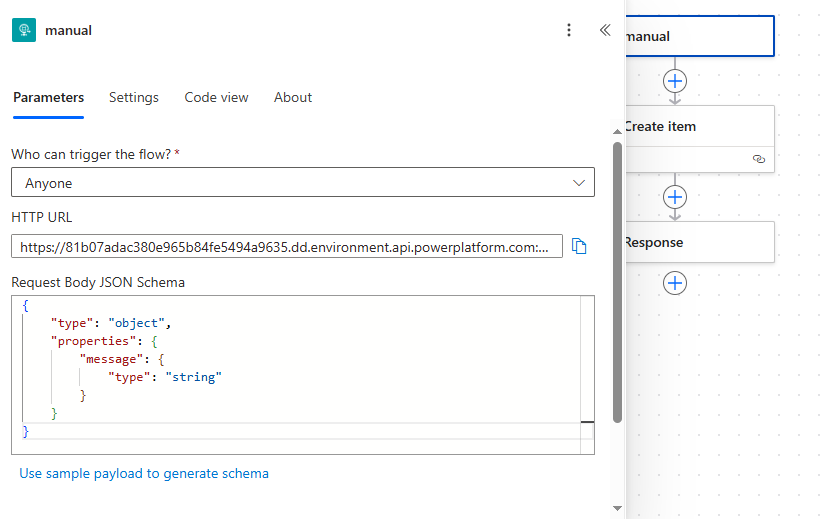
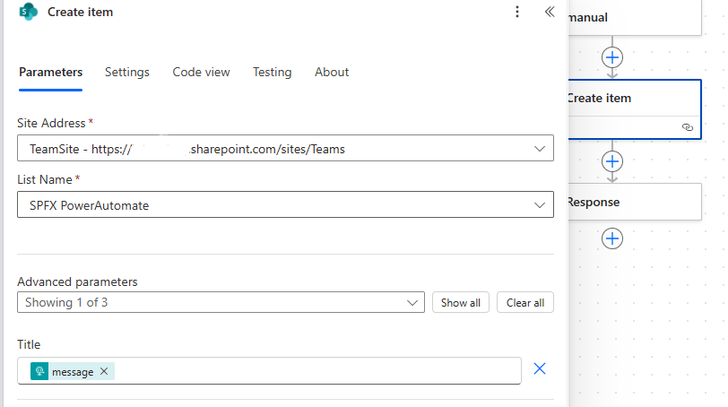
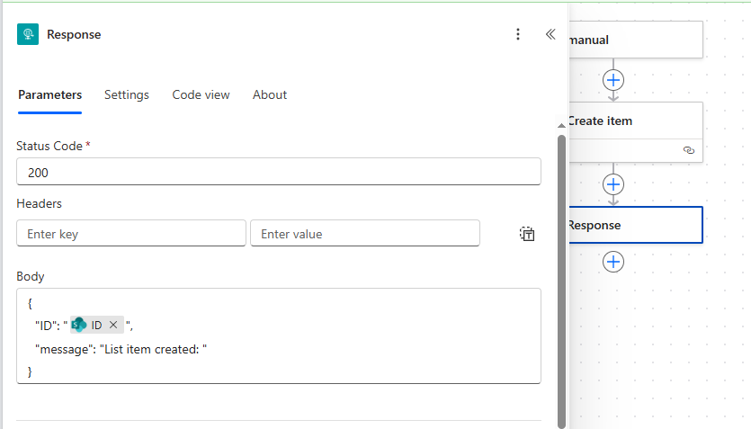

# sp-fx-power-automate

## Summary

## SPFx React Power Automate Trigger Demo
This project demonstrates how to trigger a Power Automate flow directly from a SharePoint Framework (SPFx) React web part using the HttpClient.

✨ Features
- SPFx web part built with React.
- Renders a button in the page.
- On button click, makes a POST request to a Power Automate flow HTTP trigger URL.
- Displays success or error messages in the web part.

📂 Project Structure
- React Component (FlowTrigger.tsx) – contains the button and flow trigger logic.
- SPFx Web Part – passes the context to the React component for making HTTP requests.

🛠 Setup Instructions
1. Update Flow URL
- Replace the placeholder in FlowTrigger.tsx with your Power Automate flow HTTP request URL:
- const powerautomateURL = "YOUR_FLOW_URL_HERE";

2. Build & Package Solution
- gulp build
- gulp bundle --ship
- gulp package-solution --ship

3. Deploy
- Upload the .sppkg file from sharepoint/solution/ to your App Catalog.
- Deploy the package.

4. Add to Page
- Edit any SharePoint page.
- Add the web part from the toolbox.
- Publish the page.

▶️ Usage
- Open the SharePoint page where the web part is added.
- Click “Trigger Power Automate” button.
- The flow runs, and the result message (success or error) appears below the button.

power automate flow:

after saving the flow you will receive url on triggere copy that and paste it in react code.

🔧 Tech Stack
- SharePoint Framework (SPFx)
- React
- Power Automate (HTTP Trigger Flow)
- TypeScript

✅ Example Output
When successful, you will see:

✅ Flow triggered successfully!
If something goes wrong:

❌ Failed to trigger flow: BadRequest

## Used SharePoint Framework Version

## Applies to

- [SharePoint Framework](https://aka.ms/spfx)
- [Microsoft 365 tenant](https://docs.microsoft.com/en-us/sharepoint/dev/spfx/set-up-your-developer-tenant)

> Get your own free development tenant by subscribing to [Microsoft 365 developer program](http://aka.ms/o365devprogram)

## Prerequisites

> Any special pre-requisites?

## Solution

| Solution    | Author(s)                                               |
| ----------- | ------------------------------------------------------- |
| folder name | Author details (name, company, twitter alias with link) |

## Version history

| Version | Date             | Comments        |
| ------- | ---------------- | --------------- |
| 1.1     | March 10, 2021   | Update comment  |
| 1.0     | January 29, 2021 | Initial release |

## Disclaimer

**THIS CODE IS PROVIDED _AS IS_ WITHOUT WARRANTY OF ANY KIND, EITHER EXPRESS OR IMPLIED, INCLUDING ANY IMPLIED WARRANTIES OF FITNESS FOR A PARTICULAR PURPOSE, MERCHANTABILITY, OR NON-INFRINGEMENT.**

---

## Minimal Path to Awesome

- Clone this repository
- Ensure that you are at the solution folder
- in the command-line run:
  - **npm install**
  - **gulp serve**

> Include any additional steps as needed.

> Notice that better pictures and documentation will increase the sample usage and the value you are providing for others. Thanks for your submissions advance.

> Share your web part with others through Microsoft 365 Patterns and Practices program to get visibility and exposure. More details on the community, open-source projects and other activities from http://aka.ms/m365pnp.

## References

- [Getting started with SharePoint Framework](https://docs.microsoft.com/en-us/sharepoint/dev/spfx/set-up-your-developer-tenant)
- [Building for Microsoft teams](https://docs.microsoft.com/en-us/sharepoint/dev/spfx/build-for-teams-overview)
- [Use Microsoft Graph in your solution](https://docs.microsoft.com/en-us/sharepoint/dev/spfx/web-parts/get-started/using-microsoft-graph-apis)
- [Publish SharePoint Framework applications to the Marketplace](https://docs.microsoft.com/en-us/sharepoint/dev/spfx/publish-to-marketplace-overview)
- [Microsoft 365 Patterns and Practices](https://aka.ms/m365pnp) - Guidance, tooling, samples and open-source controls for your Microsoft 365 development
